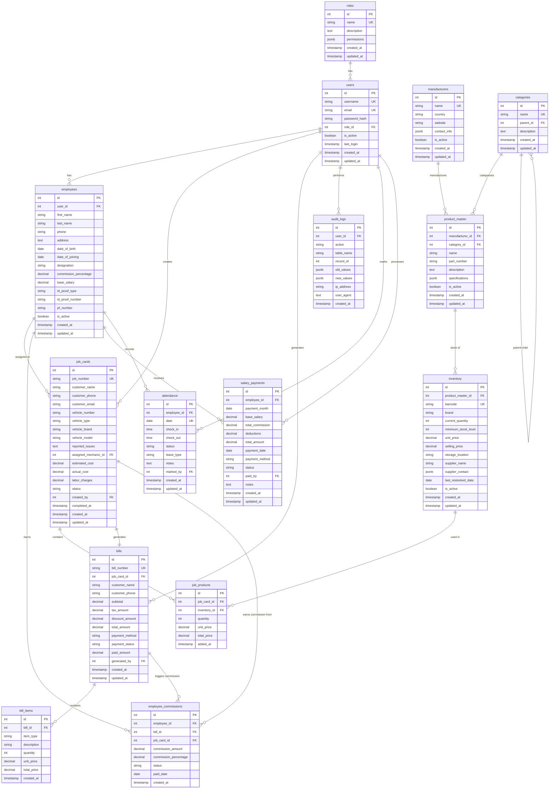

# 📊 Database Schema Documentation

## Entity Relationship Diagram



## Table Descriptions

### 1. **roles**
Defines user roles and their permissions.
- **Primary Key**: id
- **Unique**: name
- **Relationships**: One-to-Many with users

### 2. **users**
Core authentication and user management table.
- **Primary Key**: id
- **Foreign Keys**: role_id → roles(id)
- **Unique**: username, email
- **Relationships**: 
  - One-to-One with employees
  - One-to-Many with job_cards (as creator)
  - One-to-Many with bills (as generator)

### 3. **employees**
Complete employee records with commission settings.
- **Primary Key**: id
- **Foreign Keys**: user_id → users(id)
- **Relationships**:
  - One-to-Many with job_cards (as assigned mechanic)
  - One-to-Many with employee_commissions
  - One-to-Many with salary_payments
  - One-to-Many with attendance

### 4. **manufacturers**
Master list of all product manufacturers.
- **Primary Key**: id
- **Unique**: name
- **Relationships**: One-to-Many with product_master

### 5. **categories**
Hierarchical product categorization (supports parent-child).
- **Primary Key**: id
- **Foreign Keys**: parent_id → categories(id) (self-referencing)
- **Unique**: name
- **Relationships**: One-to-Many with product_master

### 6. **product_master**
Master catalog of all available products across manufacturers.
- **Primary Key**: id
- **Foreign Keys**: 
  - manufacturer_id → manufacturers(id)
  - category_id → categories(id)
- **Relationships**: One-to-Many with inventory

### 7. **inventory**
Actual stock/inventory with pricing and quantity.
- **Primary Key**: id
- **Foreign Keys**: product_master_id → product_master(id)
- **Unique**: barcode
- **Relationships**: One-to-Many with job_products

### 8. **job_cards**
Core job/task management for vehicle servicing.
- **Primary Key**: id
- **Foreign Keys**: 
  - assigned_mechanic_id → employees(id)
  - created_by → users(id)
- **Unique**: job_number
- **Status Flow**: Created → In Progress → Washing → Completed
- **Relationships**: 
  - One-to-Many with job_products
  - One-to-One with bills
  - One-to-Many with employee_commissions

### 9. **job_products**
Junction table linking job cards with inventory items used.
- **Primary Key**: id
- **Foreign Keys**: 
  - job_card_id → job_cards(id)
  - inventory_id → inventory(id)
- **Purpose**: Tracks which products were used in which jobs

### 10. **bills**
Invoice/billing records generated from completed jobs.
- **Primary Key**: id
- **Foreign Keys**: 
  - job_card_id → job_cards(id)
  - generated_by → users(id)
- **Unique**: bill_number
- **Relationships**: 
  - One-to-Many with bill_items
  - One-to-Many with employee_commissions

### 11. **bill_items**
Individual line items in a bill.
- **Primary Key**: id
- **Foreign Keys**: bill_id → bills(id)
- **Item Types**: Product, Labor, Other

### 12. **employee_commissions**
Tracks commissions earned by employees from jobs.
- **Primary Key**: id
- **Foreign Keys**: 
  - employee_id → employees(id)
  - bill_id → bills(id)
  - job_card_id → job_cards(id)
- **Status**: Pending, Paid

### 13. **salary_payments**
Monthly salary payment records including commissions.
- **Primary Key**: id
- **Foreign Keys**: 
  - employee_id → employees(id)
  - paid_by → users(id)

### 14. **attendance**
Daily attendance tracking for employees.
- **Primary Key**: id
- **Foreign Keys**: 
  - employee_id → employees(id)
  - marked_by → users(id)
- **Unique**: (employee_id, date)

### 15. **audit_logs**
System-wide audit trail for all critical operations.
- **Primary Key**: id
- **Foreign Keys**: user_id → users(id)
- **Purpose**: Track all changes for compliance and debugging

## Views

### vw_low_stock_items
Shows inventory items at or below minimum stock level.

### vw_active_jobs
Lists all jobs that are not yet completed.

### vw_employee_performance
Aggregated performance metrics per employee.

### vw_daily_revenue
Daily revenue summary with payment status.

## Key Features

### Auto-Generated Fields
- **job_number**: Auto-generated as `JOB{YYYYMMDD}{00001}`
- **bill_number**: Auto-generated as `BILL{YYYYMMDD}{00001}`
- **barcode**: Auto-generated as `BAR{0000000001}`

### Automatic Timestamps
All tables have `created_at` and most have `updated_at` with automatic triggers.

### Indexes
Optimized indexes on:
- Foreign keys
- Frequently queried fields (email, barcode, job_number, etc.)
- Date fields for reporting
- Status fields for filtering

### Constraints
- **Check Constraints**: vehicle_type, status fields, payment_status
- **Foreign Key Constraints**: Maintain referential integrity
- **Unique Constraints**: Prevent duplicates
- **Not Null Constraints**: Ensure data quality

## Workflow Summary

```
1. Create Job Card
   ↓
2. Assign Mechanic
   ↓
3. Add Products to Job (from Inventory)
   ↓
4. Update Job Status (Created → In Progress → Washing)
   ↓
5. Complete Job
   ↓
6. Generate Bill (auto-calculate from job_products + labor)
   ↓
7. Deduct Inventory
   ↓
8. Calculate & Record Commission
   ↓
9. Process Payment
   ↓
10. Mark Salary Payment (Monthly)
```

## Security Features

1. **Role-based Access Control**: Via roles table
2. **Audit Logging**: All critical operations logged
3. **Soft Deletes**: is_active flags instead of hard deletes
4. **Data Integrity**: Foreign key constraints
5. **Password Security**: Hashed passwords (bcrypt)

## Performance Optimizations

1. **Strategic Indexes**: On frequently queried columns
2. **Views**: Pre-computed queries for common reports
3. **Partitioning Ready**: Can partition audit_logs by date
4. **JSONB**: For flexible metadata storage with indexing support
